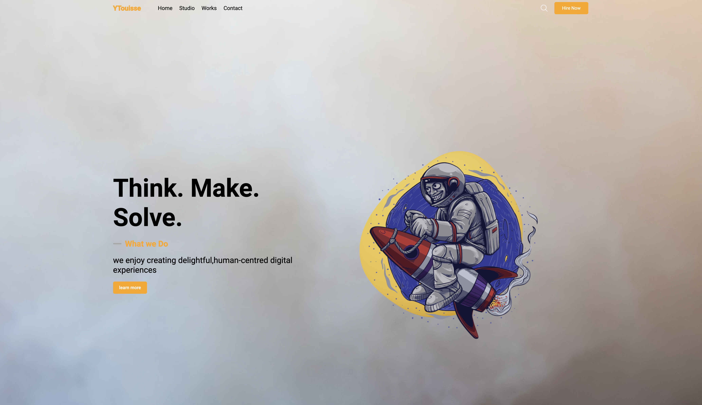

# React 3D Website

A modern web application built with **React**, **Three.js**, **EmailJS**, and **Styled Components**, allowing users to interact with 3D objects and explore a map-based interface directly in the browser.

---

## 🚀 Features

- 🌐 Interactive 3D scenes powered by Three.js
- ✉️ Contact form using EmailJS
- 🎨 Styled Components for scoped styling
- 📱 Responsive and mobile-friendly design

---

## 📦 Installation

Follow these steps to get the project up and running locally:

1. **Clone the repository:**
   ```
   git clone https://github.com/DmitryFullStackDev/threeReact.git
   cd react-3d-website
   ```

2. **Install dependencies:**
   ```
   npm install
   ```

3 **Set up environment variables:**
   ```
    VITE_EMAILJS_USER_ID=<your EmailJS user ID>
    VITE_EMAILJS_SERVICE_ID=<your EmailJS service ID>
    VITE_EMAILJS_TEMPLATE_ID=<your EmailJS template ID>
   ```

3 **Start the development server:**
   ```
    npm run dev
   ```

## 💻 Usage
Once the server is running, open your browser at http://localhost:5173 (or the port shown in your terminal).

- 🌀 Drag or click to interact with 3D elements.
- 📬 Submit the contact form to send a message via EmailJS.

## 🧪 Tech Stack
- React – Frontend framework
- Three.js – 3D graphics rendering
- EmailJS – Email integration
- Styled Components – CSS-in-JS styling

## ✨ Demo
Experience the app simulation live:
https://three-react-three.vercel.app/ 🔥

## 🧩Interface

